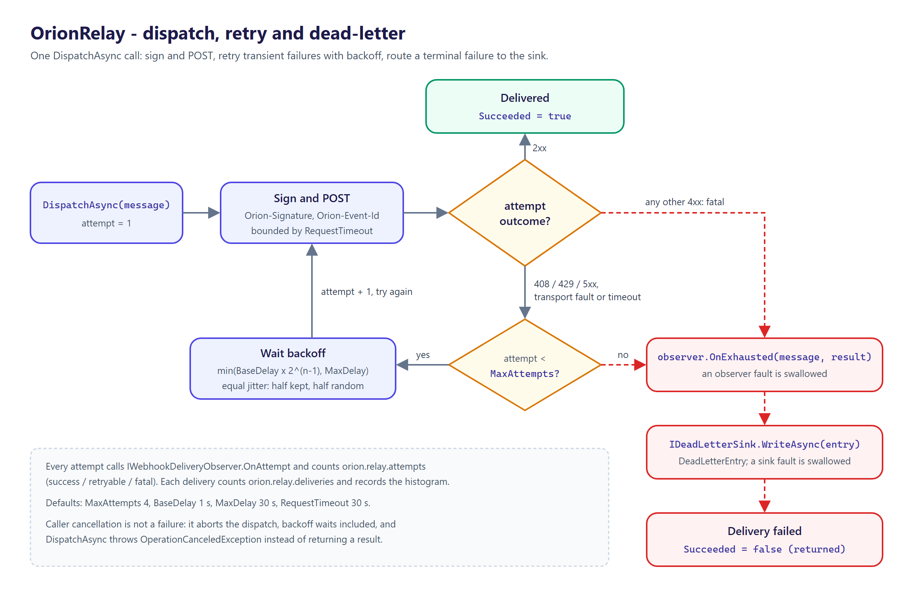

# OrionRelay Features

A feature-by-feature tour of the public surface of `Moongazing.OrionRelay` (NuGet id `OrionRelay`)
and its companion `Moongazing.OrionRelay.EntityFrameworkCore` (NuGet id `OrionRelay.EntityFrameworkCore`).
Everything here reflects the shipped `0.5.0` API. Internals such as the backoff calculation and the
HTTP request construction are private and are described only by their observable behaviour.

---

## Table of contents

1. [Webhook dispatch](#1-webhook-dispatch)
2. [Request signing](#2-request-signing)
3. [Retries and backoff](#3-retries-and-backoff)
4. [Delivery options](#4-delivery-options)
5. [Delivery result](#5-delivery-result)
6. [Delivery observer](#6-delivery-observer)
7. [Telemetry](#7-telemetry)
8. [Dependency injection](#8-dependency-injection)

---

## 1. Webhook dispatch

`IWebhookDispatcher` delivers a single `WebhookMessage` and reports the outcome.

```csharp
Task<WebhookDeliveryResult> DispatchAsync(
    WebhookMessage message, CancellationToken cancellationToken = default);
```

- Returns when delivery succeeds (a 2xx response), a non-retryable status ends it, or the attempt
  budget is exhausted.
- A cancelled `cancellationToken` aborts the whole delivery, including backoff waits, and throws
  `OperationCanceledException` rather than returning a failure result.
- Each attempt POSTs the message body to `WebhookMessage.Endpoint` with the configured content type.

`WebhookMessage` carries the payload and routing metadata:

| Property | Type | Required | Notes |
|----------|------|----------|-------|
| `Endpoint` | `Uri` | Yes | Absolute endpoint to POST to. |
| `Body` | `ReadOnlyMemory<byte>` | Yes | Transmitted verbatim; covered by the signature. |
| `ContentType` | `string` | No | Defaults to `application/json`. |
| `EventId` | `string?` | No | Sent as the `Orion-Event-Id` header for receiver-side deduplication. |
| `EventType` | `string?` | No | Sent as the `Orion-Event-Type` header; also tags telemetry. |

---

## 2. Request signing

`IWebhookSigner` / `WebhookSigner` produce the signature header a receiver uses to verify a request.

```csharp
string Sign(ReadOnlySpan<byte> body, DateTimeOffset timestamp);
```

- HMAC-SHA256 over `<unix-seconds>.<body>`, so the send timestamp is bound into the MAC.
- Returns a header value of the form `t=<unix-seconds>,v1=<hex-hmac>` (lowercase hex).
- The secret is provided once at construction and never leaves the instance; an empty secret is
  rejected with `ArgumentException`.
- The dispatcher adds the value under the header named by `WebhookDeliveryOptions.SignatureHeader`
  (default `Orion-Signature`) when a signer is configured.

Because the timestamp is part of the signed input, a receiver that enforces a freshness window can
reject captured-and-replayed requests.

`IWebhookVerifier` / `WebhookVerifier` are the receiver-side counterpart, so a consumer no longer
hand-rolls the check:

```csharp
WebhookVerificationResult Verify(string signatureHeader, ReadOnlySpan<byte> body, DateTimeOffset now);
```

- Recomputes the MAC over the same canonical `<unix-seconds>.<body>` preimage the signer uses
  (shared through an internal `SignatureScheme`, so signer and verifier cannot drift), then compares
  in constant time with `CryptographicOperations.FixedTimeEquals`.
- Enforces a configurable freshness window in both directions (too old, or future-skewed) before the
  MAC is computed, rejecting replays. The window is set per instance; the default is
  `WebhookVerifier.DefaultTolerance` (5 minutes).
- Returns a `WebhookVerificationResult` rather than throwing: `IsValid`, plus a
  `WebhookVerificationFailure` (`None`, `Malformed`, `StaleTimestamp`, `SignatureMismatch`) naming
  the single reason a request was rejected. An empty or null secret is rejected with
  `ArgumentException`; a negative tolerance with `ArgumentOutOfRangeException`.

Verify against the raw bytes exactly as received, before any deserialization reshapes them. See the
README "Signature verification on the receiver" section for a worked handler example.

---

## 3. Retries and backoff



The dispatcher classifies each attempt and retries only the transient ones:

| Attempt outcome | Classification |
|-----------------|----------------|
| 2xx response | Success, stop |
| HTTP 408, 429, or 5xx | Retryable |
| Transport fault (`HttpRequestException`) | Retryable |
| Per-attempt timeout (not caller cancellation) | Retryable |
| Any other 4xx | Fatal, stop immediately |

Backoff between retries is exponential from `BaseDelay`, doubled per attempt and clamped to
`MaxDelay`, with equal jitter: half the computed delay is kept as a floor and the other half is
randomised, so a fleet of senders retrying the same recovering receiver does not synchronise. Each
attempt is also bounded by `RequestTimeout`, enforced by the dispatcher independently of the
`HttpClient` timeout.

---

## 4. Delivery options

`WebhookDeliveryOptions` is validated eagerly at registration; an invalid combination throws
`ArgumentOutOfRangeException` there rather than at first send.

| Option | Type | Default | Constraint |
|--------|------|---------|------------|
| `MaxAttempts` | `int` | `4` | At least 1. |
| `BaseDelay` | `TimeSpan` | `1s` | Not negative. |
| `MaxDelay` | `TimeSpan` | `30s` | Not less than `BaseDelay`. |
| `RequestTimeout` | `TimeSpan` | `30s` | Per-attempt HTTP timeout. |
| `SignatureHeader` | `string` | `Orion-Signature` | Header name for the signature value. |

---

## 5. Delivery result

`WebhookDeliveryResult` is immutable and describes the terminal outcome of a dispatch:

| Member | Type | Notes |
|--------|------|-------|
| `Succeeded` | `bool` | True when a 2xx arrived within the attempt budget. |
| `Attempts` | `int` | Attempts made, including the first send. |
| `StatusCode` | `int?` | HTTP status of the final attempt, or null when the final attempt failed at the transport level (fault or timeout). |
| `FinalException` | `Exception?` | The final attempt's transport fault or timeout, when delivery ended on one rather than an HTTP error. |

---

## 6. Delivery observer

`IWebhookDeliveryObserver` is an optional, fault-safe hook:

```csharp
void OnAttempt(WebhookMessage message, int attempt, int? statusCode, Exception? exception);
void OnExhausted(WebhookMessage message, WebhookDeliveryResult result);
```

- `OnAttempt` fires after every individual HTTP attempt, success or failure.
- `OnExhausted` fires once when a delivery ends without success: the attempt budget is exhausted or
  a non-retryable status (any `4xx` other than `408`/`429`) stops it early. The name predates the
  fatal-status case.
- It is observability only. The dispatcher swallows any exception an observer raises, so an observer
  outage can never break delivery.
- Register one in DI before resolving the dispatcher. If none is registered, the built-in
  `NullWebhookDeliveryObserver` no-op is used.

Typical uses: dead-lettering exhausted deliveries, alerting, and per-attempt audit logging.

### Dead-letter sink

`IDeadLetterSink` receives each delivery that ends without success (budget exhausted or a
non-retryable status), exactly once, after `OnExhausted`, as a `DeadLetterEntry` carrying the
message, the terminal `WebhookDeliveryResult` and `DeadLetteredAt`, so you can persist, alert on, or
replay it.

- The default registered by `AddOrionRelay` is `NullDeadLetterSink`: it discards every entry and
  retains nothing. This keeps the default safe under a prolonged receiver outage, where a retaining
  sink would otherwise hold every abandoned delivery (bodies included) for the process lifetime and
  grow the working set without bound.
- `InMemoryDeadLetterSink` is opt-in. It retains the most recent entries up to a fixed `Capacity`
  (`DefaultCapacity` = 1024) and evicts oldest-first once full, so even the in-memory option is
  bounded by construction. It is for tests, demos, and single-process apps; entries are lost on
  restart, so register a durable sink for production.
- Register your own sink in DI before the dispatcher resolves to override the default:

```csharp
// Opt into bounded in-memory capture (e.g. for local inspection):
services.AddSingleton<IDeadLetterSink>(new InMemoryDeadLetterSink(capacity: 256));
services.AddOrionRelay(signingSecret: "whsec_your_shared_secret");
```

A sink fault never breaks delivery: the dispatcher swallows any exception `WriteAsync` raises, so a
sink outage cannot turn an already-failed delivery into a thrown exception for the caller.

For a durable sink that survives a restart, the companion package `OrionRelay.EntityFrameworkCore`
implements this same `IDeadLetterSink` over a relational table via EF Core (no interface change). It
persists the whole abandoned delivery, is idempotent on the delivery id when a terminal delivery is
re-routed, and exposes a read-back query for triage. Register it with
`AddOrionRelayEntityFrameworkCoreDeadLetterSink(...)` (or the `<TContext>` overload for your own
context); it replaces the no-op default in either call order relative to `AddOrionRelay`. It
references only `Microsoft.EntityFrameworkCore.Relational`, so the consumer picks the provider. Its
public surface:

| Type / member | Notes |
|---------------|-------|
| `EntityFrameworkCoreDeadLetterSink<TContext>` | The `IDeadLetterSink`. Writes one `DeadLetterRecord` per entry through an `IDbContextFactory<TContext>`; idempotent on `DeliveryId`. |
| `GetHeldAsync(int? limit = null, CancellationToken)` | Parked deliveries, newest abandonment first; a negative limit throws `ArgumentOutOfRangeException`. |
| `CountAsync(CancellationToken)` | Number of parked deliveries. |
| `DeadLetterRecord` | `DeliveryId` (the `EventId`, or a surrogate when there is none), `Endpoint`, `Body`, `ContentType`, `EventType`, `EventId`, `Attempts`, `StatusCode`, `FinalError` (exception message), `DeadLetteredAtTicks` (UTC ticks). |
| `DeadLetterRecordConfiguration` | The mapping: table `OrionRelayDeadLetters` (`DefaultTableName`, or a custom name), key `DeliveryId` (max 1024), index on `DeadLetteredAtTicks`. |
| `OrionRelayDeadLetterDbContext` | A ready-made context exposing `DeadLetters`. |

The sink does not create the schema; add a migration. The package is not marked AOT-compatible,
because EF Core's runtime is not trim or NativeAOT safe.

---

## 7. Telemetry

`WebhookDiagnostics` owns a `System.Diagnostics.Metrics` meter named `Moongazing.OrionRelay`
(exposed as `WebhookDiagnostics.MeterName`):

| Instrument | Kind | Tags |
|------------|------|------|
| `orion.relay.deliveries` | `Counter<long>` | `orion.outcome` (`succeeded`/`failed`), `event_type` |
| `orion.relay.attempts` | `Counter<long>` | `orion.outcome` (`success`/`retryable`/`fatal`) |
| `orion.relay.delivery.attempts` | `Histogram<int>` | `event_type` |

`WebhookDiagnostics` derives from `OrionInstrumentation` (`Orion.Abstractions` 1.0), so instrument
and tag names follow the family's `OrionTelemetry` convention, and tags set through `SetStaticTags`
(tenant, region, ...) are stamped onto every measurement. The instance is `IDisposable` (disposing it
releases the meter) and is registered as a singleton by `AddOrionRelay`. Any OpenTelemetry
`MeterProvider` or raw `MeterListener` can subscribe by meter name.

---

## 8. Dependency injection

`AddOrionRelay` is the one-call entry point:

```csharp
IServiceCollection AddOrionRelay(
    this IServiceCollection services,
    string? signingSecret = null,
    Action<WebhookDeliveryOptions>? configure = null);
```

It registers the validated options, the singleton `WebhookDiagnostics`, a signer when a non-empty
`signingSecret` is supplied, the no-op `NullDeadLetterSink` as the default `IDeadLetterSink`, a
dedicated named `HttpClient` (left uncapped so the dispatcher's per-attempt timeout governs), and the
`IWebhookDispatcher` itself. An `IWebhookDeliveryObserver`
registered before the dispatcher is resolved is picked up automatically. Registrations use
`TryAdd*`, so your own prior registrations of any of these services win.
</content>
